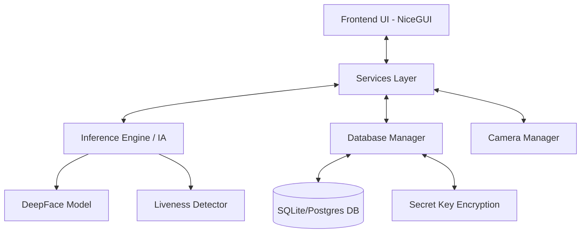
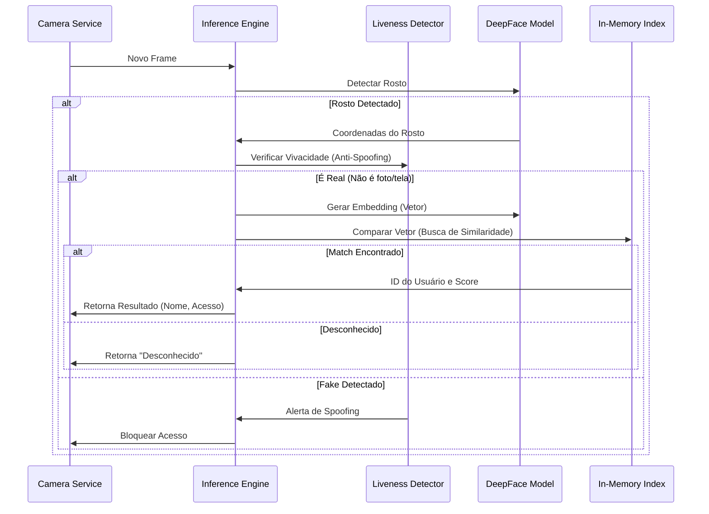
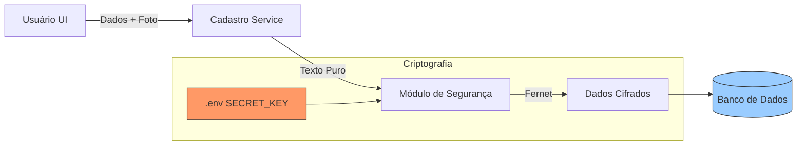

# Sistema de Controle de Acesso Facial - Certi Foundation


Sistema robusto de controle de acesso biométrico desenvolvido em Python, utilizando **DeepFace** para reconhecimento facial de alta precisão e **NiceGUI** para uma interface moderna e responsiva. O sistema suporta criptografia de dados sensíveis e detecção de vivacidade (Liveness) para prevenir fraudes.

---

## Arquitetura do Sistema

O sistema segue uma arquitetura modular baseada em serviços e eventos. Abaixo estão os fluxos principais de funcionamento.

### Visão Geral dos Componentes



### Fluxo de Reconhecimento Facial

Este fluxo ocorre em tempo real (loop da thread de inferência):



### Fluxo de Cadastro e Criptografia

Como os dados são protegidos ao salvar um novo usuário:



---

## Segurança e Criptografia
Todos os dados sensíveis (biometria, PINs e fotos) são criptografados antes de serem salvos no banco de dados.

-   **Algoritmo**: Fernet (Simétrico) da biblioteca `cryptography`.
-   **Chave Secreta (`SECRET_KEY`)**:
    -   Armazenada no arquivo `.env`.
    -   **Crítico**: Se a chave for perdida, os dados no banco tornam-se irrecuperáveis.
    -   **Compartilhamento**: Para acessar o mesmo banco de dados (ex: PostgreSQL) de múltiplos computadores, a **mesma SECRET_KEY** deve ser configurada em todos os clientes.
-   **Memória Volátil**: O motor de IA descriptografa os embeddings apenas para a memória RAM durante a inicialização. Se a chave for alterada, o motor recarrega automaticamente para garantir consistência.

---

## Estrutura de Diretórios

O projeto é organizado para facilitar a manutenção e escalabilidade:

| Diretório | Descrição |
| :--- | :--- |
| **`src/`** | Código fonte principal da aplicação. |
| &nbsp;&nbsp;`common/` | Utilitários globais: Banco de dados, Config, Logger, Segurança (`security.py`), Temas. |
| &nbsp;&nbsp;`features/` | Módulos principais de lógica: `inferencia` (IA) e `cadastro`. |
| &nbsp;&nbsp;`language/` | Gerenciamento de internacionalização (`languages.json`). |
| &nbsp;&nbsp;`pages/` | Telas da interface: Login, Dashboard, Configurações, Setup. |
| &nbsp;&nbsp;`public/` | Arquivos estáticos (Imagens, Ícones). |
| &nbsp;&nbsp;`services/` | Gerenciadores de estado (Camera, DB, Engine). |
| **`build_scripts/`** | Scripts PowerShell para gerar executáveis e atalhos. |
| **`tests/`** | Testes unitários e scripts de verificação. |

---

## Como Executar

### Pré-requisitos
-   Python 3.10+
-   Dependências listadas em `requirements.txt`

### Ambiente de Desenvolvimento
1.  **Clone o repositório**
2.  **Crie o ambiente virtual**:
    ```powershell
    python -m venv venv
    .\venv\Scripts\activate
    ```
3.  **Instale as dependências**:
    ```powershell
    pip install -r requirements.txt
    ```
4.  **Execute**:
    ```powershell
    python main.py
    ```

---

## Gerando Executáveis (Build)

O projeto possui scripts automatizados em `build_scripts/windows` para criar o distribuível.

### 1. Modo Pasta (Recomendado para Performance)
Cria uma pasta com o executável e dependências descompactadas. Inicialização instantânea.
```powershell
.\build_scripts\windows\build_folder.ps1
```
*Gera: `dist/DeepFaceRec_Unified/`*

**Atalho na Área de Trabalho**:
```powershell
.\build_scripts\windows\create_shortcut.ps1
```

### 2. Modo Arquivo Único
Cria um único arquivo `.exe`. Mais fácil de compartilhar, mas demora ~20s para iniciar (descompactação temporária).
```powershell
.\build_scripts\windows\build_unified.ps1
```
*Gera: `dist/DeepFaceRec_Unified.exe`*

---

## Configurações Avançadas

Todas as configurações de IA e Banco de Dados podem ser alteradas diretamente na interface em **Configurações > Banco de Dados** ou **Configurações > Reconhecimento**.

-   **Verify Similarity**: Impede que a foto de um usuário seja substituída por uma foto muito diferente, prevenindo erros de cadastro.
-   **Liveness Check**: Analisa micro-expressões e variações de textura para diferenciar uma foto real de uma tela/papel (Spoofing).

---

© 2026 Fundação Certi - Todos os direitos reservados.
