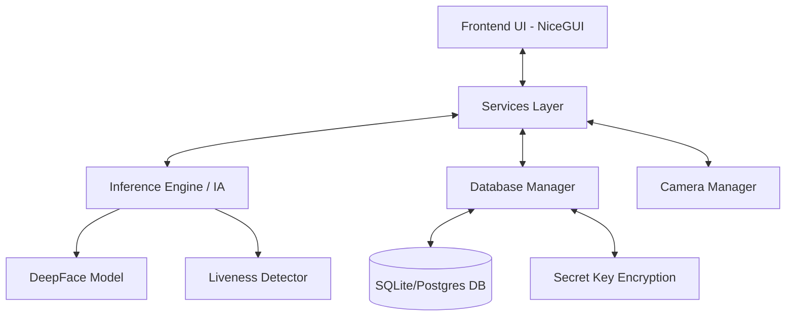
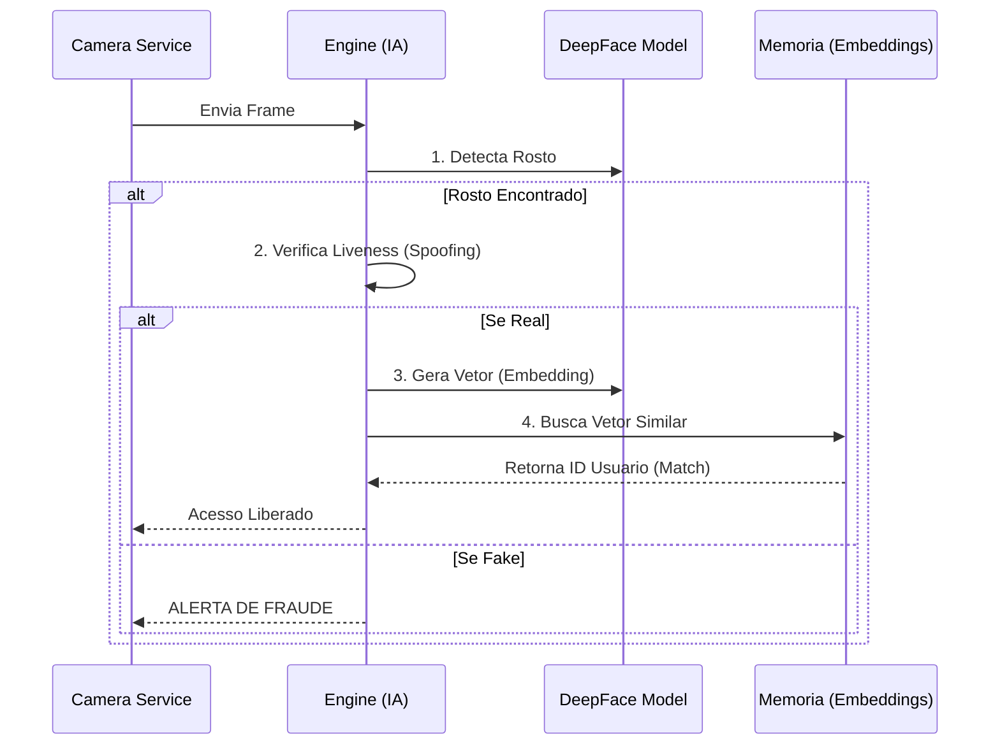
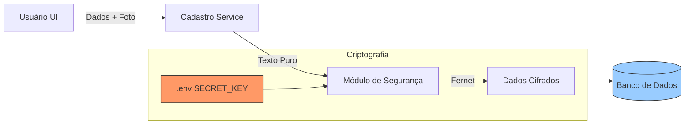

# Sistema de Controle de Acesso Facial


Sistema robusto de controle de acesso biométrico desenvolvido em Python, utilizando **DeepFace** para reconhecimento facial de alta precisão e **NiceGUI** para uma interface moderna e responsiva. O sistema suporta criptografia de dados sensíveis e detecção de vivacidade (Liveness) para prevenir fraudes.

---

## Arquitetura do Sistema

O sistema segue uma arquitetura modular baseada em serviços e eventos. Abaixo estão os fluxos principais de funcionamento.

### Visão Geral dos Componentes



### Fluxo de Reconhecimento Facial

Este fluxo ocorre em tempo real (loop da thread de inferência):



### Fluxo de Cadastro e Criptografia

Como os dados são protegidos ao salvar um novo usuário:



---

## Segurança e Criptografia
Todos os dados sensíveis (biometria, PINs e fotos) são criptografados antes de serem salvos no banco de dados.

-   **Algoritmo**: Fernet (Simétrico) da biblioteca `cryptography`.
-   **Chave Secreta (`SECRET_KEY`)**:
    -   Armazenada no arquivo `.env`.
    -   **Crítico**: Se a chave for perdida, os dados no banco tornam-se irrecuperáveis.
    -   **Compartilhamento**: Para acessar o mesmo banco de dados (ex: PostgreSQL) de múltiplos computadores, a **mesma SECRET_KEY** deve ser configurada em todos os clientes.
-   **Memória Volátil**: O motor de IA descriptografa os embeddings apenas para a memória RAM durante a inicialização. Se a chave for alterada, o motor recarrega automaticamente para garantir consistência.

---

## Estrutura de Diretórios

O projeto é organizado para facilitar a manutenção e escalabilidade:

| Diretório | Descrição |
| :--- | :--- |
| **`src/`** | Código fonte principal da aplicação. |
| &nbsp;&nbsp;`common/` | Utilitários globais: Banco de dados, Config, Logger, Segurança (`security.py`), Temas. |
| &nbsp;&nbsp;`features/` | Módulos principais de lógica: `inferencia` (IA) e `cadastro`. |
| &nbsp;&nbsp;`language/` | Gerenciamento de internacionalização (`languages.json`). |
| &nbsp;&nbsp;`pages/` | Telas da interface: Login, Dashboard, Configurações, Setup. |
| &nbsp;&nbsp;`public/` | Arquivos estáticos (Imagens, Ícones). |
| &nbsp;&nbsp;`services/` | Gerenciadores de estado (Camera, DB, Engine). |
| **`build_scripts/`** | Scripts PowerShell para gerar executáveis e atalhos. |
| **`tests/`** | Testes unitários e scripts de verificação. |

---

## Como Executar

### Pré-requisitos
-   Python 3.10+
-   Dependências listadas em `requirements.txt`

### Ambiente de Desenvolvimento
1.  **Clone o repositório**
2.  **Crie o ambiente virtual**:
    ```powershell
    python -m venv venv
    .\venv\Scripts\activate
    ```
3.  **Instale as dependências**:
    ```powershell
    pip install -r requirements.txt
    ```
4.  **Execute**:
    ```powershell
    python main.py
    ```

---

## Executando (Modos de Uso)

O executável unificado (`DeepFaceRec_Unified.exe`) suporta diferentes modos de incialização via linha de comando:

### 1. Modo Padrão (Landing Page)
Abre a tela inicial com opções de navegação.
```powershell
.\DeepFaceRec_Unified.exe
```

### 2. Gestão de Usuários (Dashboard)
Abre diretamente o painel administrativo.
```powershell
.\DeepFaceRec_Unified.exe --ManageUsers
```

### 3. Reconhecimento Facial (Login)
Abre diretamente a tela de reconhecimento/login.
```powershell
.\DeepFaceRec_Unified.exe --FaceRecognition
```

### 4. Serviço Oculto (Hidden Camera)
Monitoramento silencioso em background. A janela fica **invisível** e só aparece se detectar uma pessoa não autorizada.
```powershell
.\DeepFaceRec_Unified.exe --HiddenCam
```

#### Configurações Extras do Serviço Oculto

**Timeout (Auto-Kill)**
Fecha o aplicativo automaticamente após X segundos.
```powershell
.\DeepFaceRec_Unified.exe --HiddenCam --timeout 60
```

**Regra de Segurança (3 Strikes)**
No modo `--HiddenCam`:
- Se uma pessoa **não autorizada** (ou desconhecida) for detectada **3 vezes consecutivas**, a tela de ALERTA VERMELHO ("ACESSO NEGADO") abre em **Tela Cheia**.
- Se um **Administrador** for detectado, o contador zera e a tela se esconde novamente.

### 5. Modo CLI (Command Line Interface)
O aplicativo suporta execução via terminal para integração com outros sistemas (ex: LabVIEW).

**Argumentos:**
-   `--CheckAccess`: Inicia em modo de verificação de acesso, imprimindo o status no terminal.
-   `--CloseAfter`: Fecha o aplicativo automaticamente após um acesso permitido.
-   `--timeout <segundos>`: Define um tempo limite para fechar o aplicativo.

**Saída no Terminal:**
-   **Acesso Permitido**: `{access allowed, Nome do Usuário, Nível de Acesso}`
-   **Acesso Negado**: `{access denied}`

**Exemplo de uso (LabVIEW):**
```powershell
.\FaceRecon-V0.exe --CheckAccess --CloseAfter
```

---

## Gerando Executáveis (Build)


## Pré-requisitos
-   **Python 3.10+** com ambiente virtual configurado.
-   **Inno Setup 6** (Necessário para gerar o instalador .exe).
    -   Download: [jrsoftware.org](https://jrsoftware.org/isdl.php)

## Como Gerar o Instalador

Para gerar o instalador completo (recomendado para distribuição):

1.  Abra o terminal na raiz do projeto.
2.  Execute o script unificado:
    ```powershell
    .\build_scripts\windows\build_unified.ps1
    ```

**Saída**:
-   O instalador estará em: `dist/FaceRecon_Setup.exe`
-   A pasta da aplicação (portátil) estará em: `dist/FaceRecon-V0/`

---

## Configurações Avançadas

Todas as configurações de IA e Banco de Dados podem ser alteradas diretamente na interface em **Configurações > Banco de Dados** ou **Configurações > Reconhecimento**.

-   **Verify Similarity**: Impede que a foto de um usuário seja substituída por uma foto muito diferente, prevenindo erros de cadastro.
-   **Liveness Check**: Analisa micro-expressões e variações de textura para diferenciar uma foto real de uma tela/papel (Spoofing).

---

© 2026 Fundação Certi - Todos os direitos reservados.
